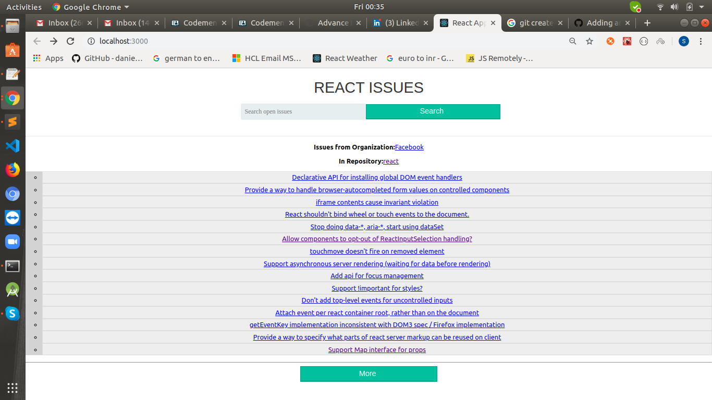

# react-graphql-api-issues

A simple React application consuming the GitHub GraphQL API with plain HTTP requests. [Read more about it over here](https://www.robinwieruch.de/react-with-graphql-tutorial).

## Features

* React 16 with create-react-app
* GitHub GraphQL API
* Consuming GraphQL with plain JS

## Installation

* `git clone git@github.com:the-road-to-graphql/react-graphql-github-vanilla.git`
* cd react-graphql-github-vanilla
* npm install
* [add your own REACT_APP_GITHUB_PERSONAL_ACCESS_TOKEN in .env file](https://help.github.com/articles/creating-a-personal-access-token-for-the-command-line/)
  * scopes/permissions you need to check: admin:org, repo, user, notifications
* npm start
* visit `http://localhost:3000`
